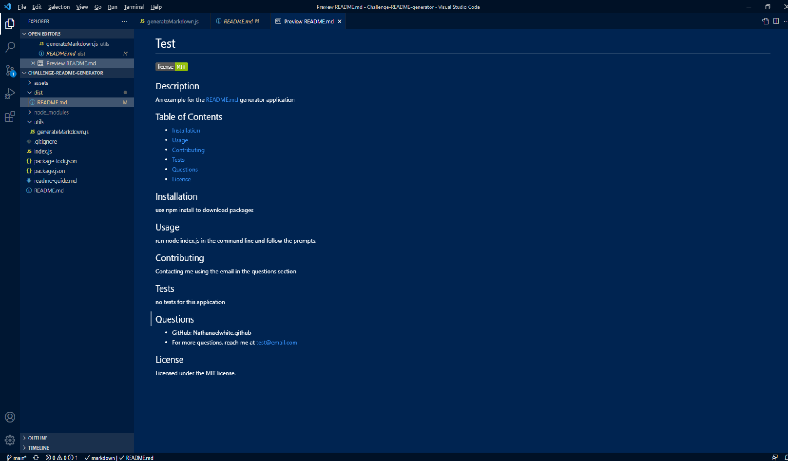

  # README Generator

  ## Description

  An application that generates a README.md based off user input.

  ## Table of Contents

  * [Installation](#installation)
  * [Usage](#installation)
  * [Contributing](#contributing)
  * [Tests](#tests)
  * [Questions](#questions)
  * [License](#license)

  
  ## Installation

  Download the repo files and run 'npm install' in the command line.

  ## Usage

  Run 'node index.js' in the command line and then follow the prompts until the terminal shows 'File Created'
  
  

  ## Contributing
  Contact me using the email in the questions section.

  ## Tests  
  No tests for this application.

  ## Questions 
  * GitHub: NathanaelWhite
  * For more questions, reach me at narhanaelw99@gmail.com